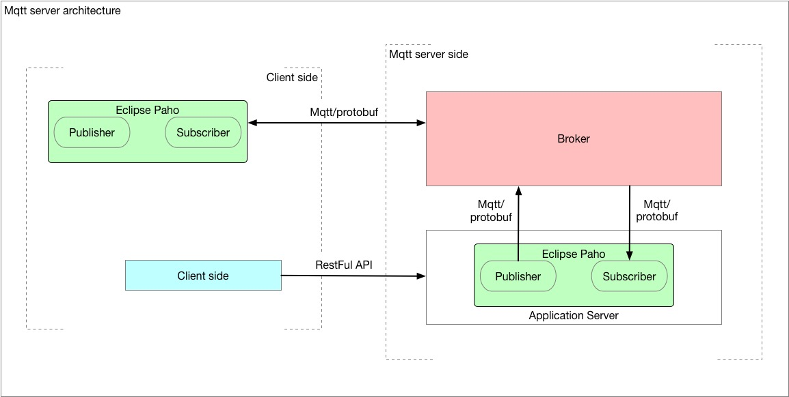

## Architecture



Server side 构成

- broker (mqtt核心：用于消息的发送管理)
- Application Server用于处理RestFul的请求，转发为Mqtt消息
  - Publisher **本质是Mqtt client**用于发布server端消息
  - Subscriber **本质是Mqtt client**用于订阅client端消息，并显示
- Client side
  - Publisher用于发布client端消息
  - Subscriber用于订阅server端的消息
  - Client 用于发送RestFul 请求给Application Server触发消息pub/sub

**总结**：从结构上Broker算是Mqtt的本质上的Server端，从业务上讲封装了Mqtt Client pub/sub的Application server和Broker共同构成了业务上的Server端

## 安装mosquitto及基本使用

### 安装

```bash
# Install Mosquitto Broker
sudo apt-get update
sudo apt-get install mosquitto

# Install the Clients 
sudo apt-get install mosquitto-clients

```

### 开启、停止查看状态

```bash
# 查看状态
sudo service mosquitto status

# 使用默认配置打开mosquitto, 使用-v打开log功能
sudo mosquitto -c /etc/mosquitto/mosquitto.conf -v

# 停止
sudo service mosquitto stop

#开启
sudo service mosquitto start
```

### 使用mosquitto测试pub/sub

`注意` pub和sub的clientid不能相同，相同会刷屏。

```bash
# 简单测试发布。 -h host -t topic -m message
mosquitto_pub -h localhost -t mqtt-test -m 'hello mqtt'

# 简单测试订阅。
mosquitto_sub -h localhost -t mqtt-test

# 发布设置用户密码 -u user -P password 
mosquitto_pub -u admin -P admin -h localhost -t mqtt/loop/message -m 'test mqtt'
mosquitto_sub -u admin -P admin -h localhost -t mqtt/loop/message

# 指定发布clientid -i （id to use for this client）
mosquitto_sub -u admin -P admin -i shuai-ubuntu-test -h localhost -t mqtt/loop/message
mosquitto_pub -u admin -P admin -i shuai-ubuntu-test-client -h localhost -t mqtt/loop/message -m 'test mqtt client'
```

### 查看broker的log 

mosquitto的默认log 地址是：/var/log/mosquitto/xxx.log

```bash
tailf /var/log/mosquitto/mosquitto.log
```


## 构建Java-Mqtt-Server(Springboot + Mqtt)

### requirement依赖

1. mosquitto broker 

   可以使用Eclipse公开的broker，据说底层也是mosquitto。地址为`iot.eclipse.org`

   可以部署安装mosquitto(本文方案)

2. springboot (2.1.5.RELEASE)

3. Eclipse Paho

4. curl/postman

### 构建springboot项目

#### 1. 使用idea springboot initializer 初始化springboot工程

使用springboot版本**2.1.5.RELEASE**

#### 2. pom中添加

```xml
<dependency>
    <groupId>org.springframework.boot</groupId>
    <artifactId>spring-boot-starter-integration</artifactId>
</dependency>
<dependency>
    <groupId>org.springframework.integration</groupId>
    <artifactId>spring-integration-stream</artifactId>
</dependency>

<dependency>
    <groupId>org.springframework.integration</groupId>
    <artifactId>spring-integration-mqtt</artifactId>
</dependency>
<dependency>
    <groupId>org.projectlombok</groupId>
    <artifactId>lombok</artifactId>
    <version>1.16.10</version>
    <scope>provided</scope>
</dependency>
```

#### 3. MQTT Configuration

* 配置broker地址，
* 端口号，
* 是否使用ssl，
* 用户名
* 密码

~~~java
public abstract class MQTTConfig {

    protected final String broker = "10.156.2.132";
    protected final int qos = 2;
    protected Boolean hasSSL = false; /* By default SSL is disabled */
    protected Integer port = 1883; /* Default port */
    protected final String userName = "admin";
    protected final String password = "admin";
    protected final String TCP = "tcp://";
    protected final String SSL = "ssl://";

    /**
     * Custom Configuration
     *
     * @param broker
     * @param port
     * @param ssl
     * @param withUserNamePass
     */
    protected abstract void config(String broker, Integer port, Boolean ssl, Boolean withUserNamePass);

    /**
     * Default Configuration
     */
    protected abstract void config();
}

~~~


#### 4. Publisher推送者

定义接口

```java
public interface IMQTTPublisher {
    /**
     * Publish message
     *
     * @param topic
     * @param String Message
     */
    public void publishMessage(String topic, String message);

    /**
     * Disconnect MQTT Client
     */
    public void disconnect();
}

```

定义类

```java

import org.eclipse.paho.client.mqttv3.*;
import org.eclipse.paho.client.mqttv3.persist.MemoryPersistence;
import org.slf4j.Logger;
import org.slf4j.LoggerFactory;
import org.springframework.stereotype.Component;

@Component
public class MQTTPublisher extends MQTTConfig implements MqttCallback, IMQTTPublisher {

    private String brokerUrl = null;

    final private String colon = ":";
    final private String clientId = "mqtt_server_pub";

    private MqttClient mqttClient = null;
    private MqttConnectOptions connectionOptions = null;
    private MemoryPersistence persistence = null;

    private static final Logger logger = LoggerFactory.getLogger(MQTTPublisher.class);

    /**
     * Private default constructor
     */
    private MQTTPublisher() {
        this.config();
    }

    /**
     * Private constructor
     */
    private MQTTPublisher(String broker, Integer port, Boolean ssl, Boolean withUserNamePass) {
        this.config(broker, port, ssl, withUserNamePass);
    }

    /**
     * Factory method to get instance of MQTTPublisher
     *
     * @return MQTTPublisher
     */
    public static MQTTPublisher getInstance() {
        return new MQTTPublisher();
    }

    /**
     * Factory method to get instance of MQTTPublisher
     *
     * @param broker
     * @param port
     * @param ssl
     * @param withUserNamePass
     * @return MQTTPublisher
     */
    public static MQTTPublisher getInstance(String broker, Integer port, Boolean ssl, Boolean withUserNamePass) {
        return new MQTTPublisher(broker, port, ssl, withUserNamePass);
    }

    /*
     * (non-Javadoc)
     *
     * @see
     * com.bjitgroup.jasmysp.mqtt.publisher.MQTTPublisherBase#configurePublisher()
     */
    @Override
    protected void config() {

        this.brokerUrl = this.TCP + this.broker + colon + this.port;
        this.persistence = new MemoryPersistence();
        this.connectionOptions = new MqttConnectOptions();
        try {
            this.mqttClient = new MqttClient(brokerUrl, clientId, persistence);
            this.connectionOptions.setCleanSession(true);
            this.mqttClient.connect(this.connectionOptions);
            this.mqttClient.setCallback(this);
        } catch (MqttException me) {
            logger.error("ERROR", me);
        }
    }

    /*
     * (non-Javadoc)
     *
     * @see
     * com.bjitgroup.jasmysp.mqtt.publisher.MQTTPublisherBase#configurePublisher(
     * java.lang.String, java.lang.Integer, java.lang.Boolean, java.lang.Boolean)
     */
    @Override
    protected void config(String broker, Integer port, Boolean ssl, Boolean withUserNamePass) {

        String protocal = this.TCP;
        if (true == ssl) {
            protocal = this.SSL;
        }

        this.brokerUrl = protocal + this.broker + colon + port;
        this.persistence = new MemoryPersistence();
        this.connectionOptions = new MqttConnectOptions();

        try {
            this.mqttClient = new MqttClient(brokerUrl, clientId, persistence);
            this.connectionOptions.setCleanSession(true);
            if (true == withUserNamePass) {
                if (password != null) {
                    this.connectionOptions.setPassword(this.password.toCharArray());
                }
                if (userName != null) {
                    this.connectionOptions.setUserName(this.userName);
                }
            }
            this.mqttClient.connect(this.connectionOptions);
            this.mqttClient.setCallback(this);
        } catch (MqttException me) {
            logger.error("ERROR", me);
        }
    }


    /*
     * (non-Javadoc)
     * @see com.monirthought.mqtt.publisher.MQTTPublisherBase#publishMessage(java.lang.String, java.lang.String)
     */
    @Override
    public void publishMessage(String topic, String message) {

        try {
            MqttMessage mqttmessage = new MqttMessage(message.getBytes());
            mqttmessage.setQos(this.qos);
            this.mqttClient.publish(topic, mqttmessage);
        } catch (MqttException me) {
            logger.error("ERROR", me);
        }

    }

    /*
     * (non-Javadoc)
     * @see org.eclipse.paho.client.mqttv3.MqttCallback#connectionLost(java.lang.Throwable)
     */
    @Override
    public void connectionLost(Throwable arg0) {
        logger.info("Connection Lost");

    }

    /*
     * (non-Javadoc)
     * @see org.eclipse.paho.client.mqttv3.MqttCallback#deliveryComplete(org.eclipse.paho.client.mqttv3.IMqttDeliveryToken)
     */
    @Override
    public void deliveryComplete(IMqttDeliveryToken arg0) {
        logger.info("delivery completed");

    }

    /*
     * (non-Javadoc)
     * @see org.eclipse.paho.client.mqttv3.MqttCallback#messageArrived(java.lang.String, org.eclipse.paho.client.mqttv3.MqttMessage)
     */
    @Override
    public void messageArrived(String arg0, MqttMessage arg1) throws Exception {
        // Leave it blank for Publisher

    }

    /*
     * (non-Javadoc)
     * @see com.monirthought.mqtt.publisher.MQTTPublisherBase#disconnect()
     */
    @Override
    public void disconnect() {
        try {
            this.mqttClient.disconnect();
        } catch (MqttException me) {
            logger.error("ERROR", me);
        }
    }

}
```


#### 5. Subscriber 订阅者

定义接口

```java
import org.slf4j.Logger;
import org.slf4j.LoggerFactory;

public interface IMQTTSubscriber {
    public static final Logger logger = LoggerFactory.getLogger(IMQTTSubscriber.class);

    /**
     * Subscribe message
     *
     * @param topic
     * @param jasonMessage
     */
    public void subscribeMessage(String topic);

    /**
     * Disconnect MQTT Client
     */
    public void disconnect();
}

```

类定义

```java
import org.eclipse.paho.client.mqttv3.*;
import org.eclipse.paho.client.mqttv3.persist.MemoryPersistence;
import org.slf4j.Logger;
import org.slf4j.LoggerFactory;
import org.springframework.stereotype.Component;

import java.sql.Timestamp;

@Component
public class MQTTSubscriber extends MQTTConfig implements MqttCallback, IMQTTSubscriber {

    private String brokerUrl = null;
    final private String colon = ":";
    final private String clientId = "mqtt_server_sub";

    private MqttClient mqttClient = null;
    private MqttConnectOptions connectionOptions = null;
    private MemoryPersistence persistence = null;

    private static final Logger logger = LoggerFactory.getLogger(MQTTSubscriber.class);

    public MQTTSubscriber() {
        this.config();
    }

    /*
     * (non-Javadoc)
     *
     * @see org.eclipse.paho.client.mqttv3.MqttCallback#connectionLost(java.lang.
     * Throwable)
     */
    @Override
    public void connectionLost(Throwable cause) {
        logger.info("Connection Lost");

    }

    /*
     * (non-Javadoc)
     *
     * @see
     * org.eclipse.paho.client.mqttv3.MqttCallback#messageArrived(java.lang.String,
     * org.eclipse.paho.client.mqttv3.MqttMessage)
     */
    @Override
    public void messageArrived(String topic, MqttMessage message) throws Exception {
        // Called when a message arrives from the server that matches any
        // subscription made by the client
        String time = new Timestamp(System.currentTimeMillis()).toString();
        System.out.println();
        System.out.println("***********************************************************************");
        System.out.println("Message Arrived at Time: " + time + "  Topic: " + topic + "  Message: "
                + new String(message.getPayload()));
        System.out.println("***********************************************************************");
        System.out.println();
    }

    /*
     * (non-Javadoc)
     *
     * @see
     * org.eclipse.paho.client.mqttv3.MqttCallback#deliveryComplete(org.eclipse.paho
     * .client.mqttv3.IMqttDeliveryToken)
     */
    @Override
    public void deliveryComplete(IMqttDeliveryToken token) {
        // Leave it blank for subscriber

    }

    /*
     * (non-Javadoc)
     *
     * @see
     * com.monirthought.mqtt.subscriber.MQTTSubscriberBase#subscribeMessage(java.
     * lang.String)
     */
    @Override
    public void subscribeMessage(String topic) {
        try {
            this.mqttClient.subscribe(topic, this.qos);
        } catch (MqttException me) {
            me.printStackTrace();
        }
    }

    /*
     * (non-Javadoc)
     *
     * @see com.monirthought.mqtt.subscriber.MQTTSubscriberBase#disconnect()
     */
    public void disconnect() {
        try {
            this.mqttClient.disconnect();
        } catch (MqttException me) {
            logger.error("ERROR", me);
        }
    }

    /*
     * (non-Javadoc)
     *
     * @see com.monirthought.config.MQTTConfig#config(java.lang.String,
     * java.lang.Integer, java.lang.Boolean, java.lang.Boolean)
     */
    @Override
    protected void config(String broker, Integer port, Boolean ssl, Boolean withUserNamePass) {

        String protocal = this.TCP;
        if (true == ssl) {
            protocal = this.SSL;
        }

        this.brokerUrl = protocal + this.broker + colon + port;
        this.persistence = new MemoryPersistence();
        this.connectionOptions = new MqttConnectOptions();

        try {
            this.mqttClient = new MqttClient(brokerUrl, clientId, persistence);
            this.connectionOptions.setCleanSession(true);
            if (true == withUserNamePass) {
                if (password != null) {
                    this.connectionOptions.setPassword(this.password.toCharArray());
                }
                if (userName != null) {
                    this.connectionOptions.setUserName(this.userName);
                }
            }
            this.mqttClient.connect(this.connectionOptions);
            this.mqttClient.setCallback(this);
        } catch (MqttException me) {
            me.printStackTrace();
        }

    }

    /*
     * (non-Javadoc)
     *
     * @see com.monirthought.config.MQTTConfig#config()
     */
    @Override
    protected void config() {

        this.brokerUrl = this.TCP + this.broker + colon + this.port;
        this.persistence = new MemoryPersistence();
        this.connectionOptions = new MqttConnectOptions();
        try {
            this.mqttClient = new MqttClient(brokerUrl, clientId, persistence);
            this.connectionOptions.setCleanSession(true);
            this.mqttClient.connect(this.connectionOptions);
            this.mqttClient.setCallback(this);
        } catch (MqttException me) {
            me.printStackTrace();
        }

    }

}
```

#### 6. 构建 RestFul接口

构建Controller

```java
import lombok.extern.slf4j.Slf4j;
import org.slf4j.Logger;
import org.slf4j.LoggerFactory;
import org.springframework.beans.factory.annotation.Autowired;
import org.springframework.web.bind.annotation.*;

import javax.annotation.PostConstruct;

@Slf4j
@RestController
public class DemoRestController {
    public static String TOPIC_LOOP_TEST = "mqtt/loop/message";

		@Autowired
    IMQTTPublisher publisher;

    @Autowired
    IMQTTSubscriber subscriber;
    
    @PostConstruct
    public void init() {
        subscriber.subscribeMessage(TOPIC_LOOP_TEST);    
    }
    
    @RequestMapping(value = "/mqtt/loop/message", method = RequestMethod.POST)
    public String index(@RequestBody String data) {
        publisher.publishMessage(TOPIC_LOOP_TEST, data);
        return "Success";
    }
    
}    
```

#### 7. 使用curl命令进行api调用测试

```bash
❯ curl -X POST "http://127.0.0.1:8080/mqtt/loop/message" -d "test"
Success%

# springboot 窗口中可以看到自己sub的回显
***********************************************************************
Message Arrived at Time: 2019-05-21 16:11:13.675  Topic: mqtt/loop/message  Message: test=
***********************************************************************
```

也可以使用postman 调用8080 端口调试。

## 构建Java-Mqtt-Server (Springboot + Mqtt +protobuf)

在现有基础上添加protobuf包装pub/sub 消息

#### 1. proto文件

将.proto文件放到`src/main/proto/`下

#### 2. 使用maven生成protobuf java代码

pom中properties中添加

```xml
<properties>
    <java.version>1.8</java.version>
    <grpc.version>1.6.1</grpc.version>
    <protobuf.version>3.3.0</protobuf.version>
</properties>
```

pom dependencies中添加

```xml
<dependency>
            <groupId>io.grpc</groupId>
            <artifactId>grpc-netty</artifactId>
            <version>${grpc.version}</version>
            <scope>provided</scope>
        </dependency>
        <dependency>
            <groupId>io.grpc</groupId>
            <artifactId>grpc-protobuf</artifactId>
            <version>${grpc.version}</version>
            <scope>provided</scope>
        </dependency>
        <dependency>
            <groupId>io.grpc</groupId>
            <artifactId>grpc-stub</artifactId>
            <version>${grpc.version}</version>
            <scope>provided</scope>
        </dependency>
        <dependency>
            <groupId>com.google.protobuf</groupId>
            <artifactId>protobuf-java</artifactId>
            <version>${protobuf.version}</version>
        </dependency>
```

pom build中添加，pom plugins中添加

```xml
<build>
        <!--protobuf ext-->
        <extensions>
            <extension>
                <groupId>kr.motd.maven</groupId>
                <artifactId>os-maven-plugin</artifactId>
                <version>1.5.0.Final</version>
            </extension>
        </extensions>

        <plugins>
            <plugin>
                <groupId>org.springframework.boot</groupId>
                <artifactId>spring-boot-maven-plugin</artifactId>
            </plugin>

            <plugin>
                <groupId>org.xolstice.maven.plugins</groupId>
                <artifactId>protobuf-maven-plugin</artifactId>
                <version>0.5.0</version>
                <configuration>
                    <protocArtifact>com.google.protobuf:protoc:${protobuf.version}:exe:${os.detected.classifier}</protocArtifact>
                    <pluginId>grpc-java</pluginId>
                    <pluginArtifact>io.grpc:protoc-gen-grpc-java:${grpc.version}:exe:${os.detected.classifier}</pluginArtifact>
                </configuration>
                <executions>
                    <execution>
                        <goals>
                            <goal>compile</goal>
                            <goal>compile-custom</goal>
                        </goals>
                    </execution>
                </executions>
            </plugin>
        </plugins>
    </build>
```


使用IDE中右侧Maven Projects -> Lifecycle ->compile 生成java对应的protobuf文件

生成的路径在：`target/generated-sources/protobuf/java/对应的包名下 `

#### 3. 使用proto封装mqtt message

使用Proto中的newBuilder构建builder。使用builder中的set方法设置proto中的参数，例如：

```java
KylinProto.Group.Builder builder = KylinProto.Group.newBuilder();
KylinProto.Group group = builder.setThreshold(85.f)
                .setTop(1)
                .setGroup(group_name).build();
publisher.publish(topic, group.toByteArray(), 2, false);

```

